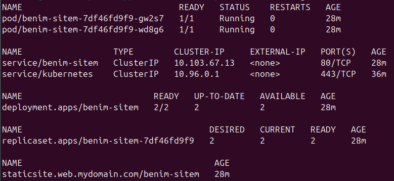
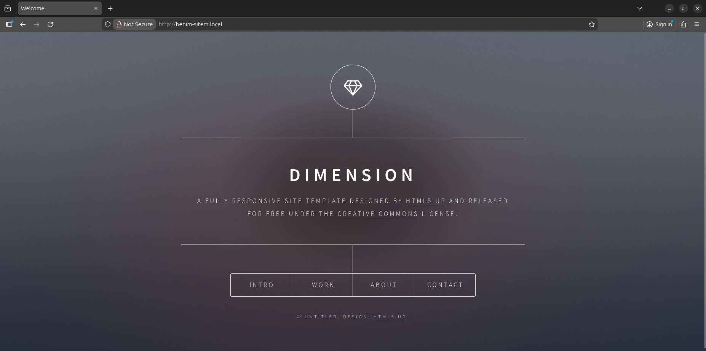

# Kubernetes StaticSite Operator




Bu proje, Kubernetes üzerinde statik web sitelerini (HTML/CSS/JS) saniyeler içinde yayına almak için geliştirilmiş bir **Kubernetes Operator** projesidir.

**Golang** ve **Kubebuilder** kullanılarak geliştirilmiştir. Kubernetes'in `Reconciliation Loop` (Uzlaşma Döngüsü) mantığı ile çalışır.

## 🚀 Ne Yapar?

Kullanıcı sadece basit bir YAML dosyası (`StaticSite`) oluşturur. Operator arka planda şunları otomatik yönetir:

1.  **Deployment:** Nginx container'ı ve Git-Sync (Init Container) içeren Pod'ları yaratır.
2.  **Service:** Pod'lara erişim için ClusterIP servisi açar.
3.  **Ingress:** Siteyi dış dünyaya (veya host makineye) açan yönlendirme kuralını yazar.
4.  **Self-Healing:** Eğer biri Deployment veya Service'i silerse, Operator bunu fark edip milisaniyeler içinde yeniden yaratır.

## Architecture

* **Language:** Go (Golang)
* **Framework:** Kubebuilder / Controller-Runtime
* **Pattern:** Init Container Pattern (git-clone -> shared-volume -> nginx)

## 🛠 Kurulum ve Çalıştırma

### Gereksinimler
* Kubernetes Cluster (Minikube, Kind veya Cloud)
* kubectl
* Go 1.20+

### 1. CRD'leri Yükle
```bash
make install
```

### 2. Operator'ı Çalıştır
```bash
make run
```

### 3. Örnek Site Oluştur
```YAML
# config/samples/web_v1_staticsite.yaml
apiVersion: web.mydomain.com/v1
kind: StaticSite
metadata:
  name: benim-sitem
spec:
  gitRepo: "https://github.com/cloudacademy/static-website-example"
  replicas: 1
```

```bash
kubectl apply -f config/samples/web_v1_staticsite.yaml
```

**🎯 Neden Bu Proje?**
Standart bir Kubernetes kullanıcısı YAML dosyalarını elle yönetirken, bu proje ile Infrastructure as Code mantığını bir adım ileri taşıyıp Custom Controller yazdım. Bu proje şunları kanıtlar:

- K8s API'sini genişletme yeteneği (CRD).

-  Golang ile sistem programlama.

- Reconciliation Loop ve State Management mantığı.

Developed by Bilal Yılmaz


